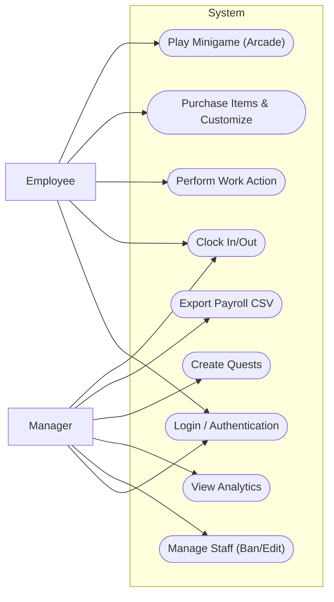
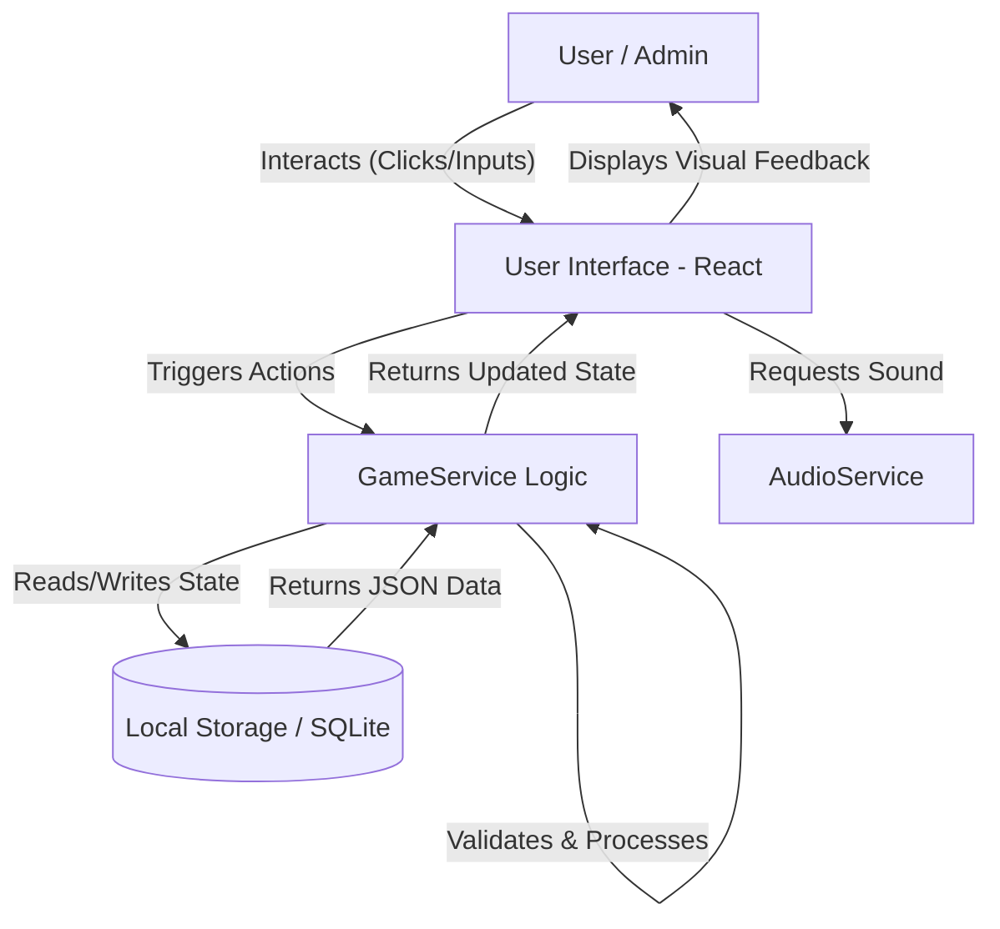

# Chapter 3: Proposed System Overview

## 3.1 Description of the Proposed System
**gOwOrk** is a modern, Single Page Application (SPA) built using React, operating on a Service-Oriented Architecture (SOA) within the client. The system is designed to digitize and gamify the shift management process, serving a dual purpose: providing a utility for precise time-tracking and creating an engagement layer that rewards positive employee behavior.

The system is conceptually divided into three main layers:

1.  **Front-End (View Layer):** A responsive, retro-themed interface built with Tailwind CSS. It hosts a 3D view using Three.js to render the employee’s Voxel Avatar, providing a visual representation of their progress.
2.  **Logic Layer (Service Layer):** A robust TypeScript service layer (consisting of `GameService` and `AudioService`) that handles business logic, such as XP calculations, shift status validation, and audio synthesis for feedback.
3.  **Data Layer (Persistence Layer):** A simulated database utilizing the browser's `localStorage` and `SQLite` (via WASM). Structured as JSON/SQL collections, this layer ensures data persistence without the need for an external cloud server, keeping the system lightweight and portable.

## 3.2 System User Profile

The system interacts with two main user groups, each with distinct roles, needs, and key interactions:

| User Profile | Role/Description | User Needs | Key System Interactions |
| :--- | :--- | :--- | :--- |
| **Employee (Hero)** | The primary end-user or staff member performing shift duties. | 1. A fun, non-intrusive way to log attendance. 2. Visual feedback for achievements. 3. Customization options for their avatar. 4. Mobile compatibility for on-the-go access. | • Clock In/Out • Complete Daily Quests • Purchase Shop Items • Play Minigames • Feed Pet/Companion |
| **Manager (Admin)** | The administrator or store manager responsible for oversight. | 1. Accurate data for payroll processing. 2. Tools to correct attendance errors. 3. Ability to incentivize staff (Bonuses). 4. Overview of team morale (Health/XP). | • View Team Analytics • Manage Users (Edit/Ban) • Export CSV Data • Trigger Global Events • Distribute Gold Bonuses |

## 3.3 Use Case Diagram

The Use Case Diagram visually defines the **functional requirements** and **scope** of the system by illustrating the key interactions between the primary actors and the system's functionalities.

*   **Employee Use Cases:** Login, Clock In/Out, Perform Work Action, Purchase Items & Customize, Play Minigame (Arcade).
*   **Manager Use Cases:** Login, Manage Staff (Ban/Edit), View Analytics, Create Quests, Export Payroll CSV.

## 3.4 Data Flow Diagram (DFD) Level 1

The DFD depicts the flow of information across the system components, highlighting the interaction between the User Interface, the Logic Service, and the Local Storage.

