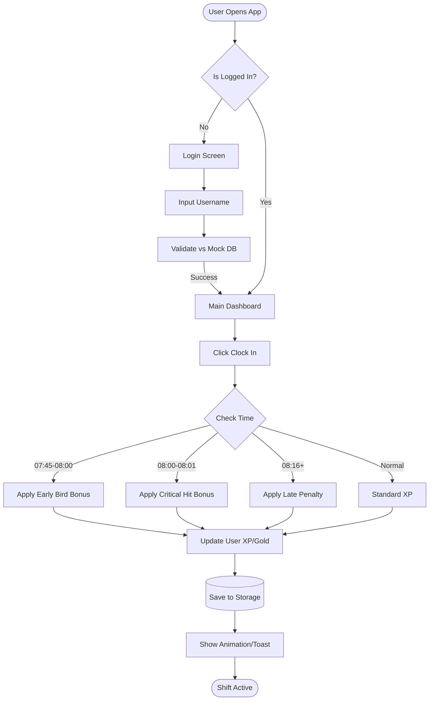

# Chapter 4: Architectural Design

## 4.1 High-Level Components & Interfaces

### 4.1.1 Components

| Component | Description | Usage in gOwOrk |
| :--- | :--- | :--- |
| **React (v18)** | A JavaScript library for building user interfaces based on components. | Serves as the core framework for the SPA, managing the View layer, state changes, and component lifecycle. |
| **Vite** | A build tool that aims to provide a faster and leaner development experience. | Handles hot module replacement (HMR) during dev and bundles assets for production. |
| **Three.js** | A cross-browser JavaScript library and application programming interface used to create and display animated 3D computer graphics. | Renders the Voxel Avatar, lighting effects, and weather particles in the `GameScene` component. |
| **Tailwind CSS** | A utility-first CSS framework. | Handles all styling, responsiveness, and retro-themed color palettes (`vt323` font, pixel borders). |
| **AudioService** | Custom TypeScript module wrapping the Web Audio API. | Generates procedural chiptune music and sound effects (coins, blips) without requiring external mp3 assets. |
| **GameService** | TypeScript Singleton Class. | Acts as the "Backend" logic layer. Handles XP calculations, quest generation, and LocalStorage persistence. |

### 4.1.2 Interfaces

*   **Game Context API:** A React Context provider that exposes the state and methods of the `GameService` to the entire component tree.
*   **LocalStorage Interface:** A JSON-based interface for persisting `Users`, `Logs`, `Quests`, and `Settings`.
*   **Canvas API:** Used for the "Coffee Rush" minigame rendering and Confetti effects overlay.

## 4.2 Physical Arrangement (Network Topology)

Since gOwOrk is designed as a portable, client-side application, the topology differs from traditional 3-tier architectures.

*   **Client Layer (Devices):** The user's device (PC, Tablet, Smartphone) executes the entire application code (Logic, UI, and Database).
*   **Distribution Layer (CDN/Host):** A Content Delivery Network (e.g., Vercel, Netlify, or GitHub Pages) serves the static build files (HTML/JS/CSS). Once loaded, the app requires no further network connection for core logic.
*   **Data Layer:** Resides physically on the Client Layer within the Browser's `LocalStorage`.

## 4.3 User Flow Diagram (The Clock-In Process)



## 4.4 Context Diagram

```mermaid
contextDiagram
    direction TB
    actor Employee
    actor Manager
    system "gOwOrk Application" as Sys
    database "Browser LocalStorage" as DB

    Employee --> Sys : Clocks In, Plays, Buys
    Manager --> Sys : Administers, Exports Data
    Sys --> DB : Persists State
    DB --> Sys : Loads State
```
