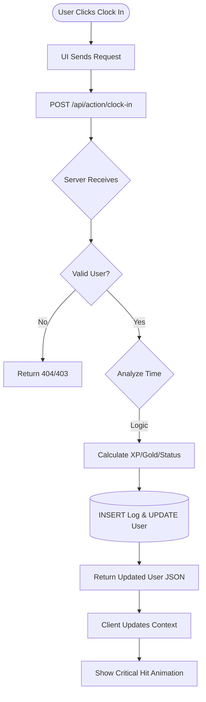
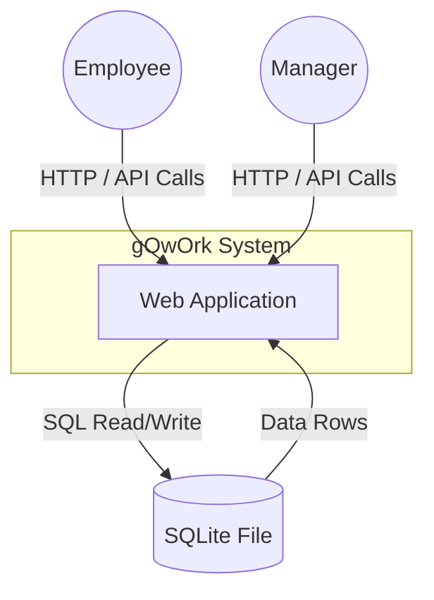

# Chapter 4: Architectural Design

## 4.1 High Level Components and Interfaces

The software architecture of the **gOwOrk** system is designed using a modern Client-Server approach to ensure security, scalability, and data integrity.

### 4.1.1 Components

The system separates concerns into the Frontend (Client) and Backend (Server).

| Component | Description | Usage in gOwOrk |
| :--- | :--- | :--- |
| **React (v18) + Vite** | Frontend Framework and Build Tool. | Renders the Single Page Application (SPA), manages UI state, and handles the 3D Voxel rendering via Three.js. |
| **Node.js + Express** | Backend Runtime and Web Framework. | Serves the static frontend assets and hosts the REST API endpoints (`/api/...`). Handles all authentication and critical business logic. |
| **Better-SQLite3** | Synchronous SQLite driver for Node.js. | Interfaces directly with the file-based database (`gowork.db`) on the server to store relational data. |
| **GameService (Client)** | TypeScript Service Class. | Acts as the API client wrapper. It abstracts `fetch` calls to the backend, handling authentication tokens (mocked via ID) and error states. |
| **Three.js** | 3D Graphics Library. | Renders the character avatar, lighting, and weather effects in the browser. |

### 4.1.2 Interfaces

The system’s components interact and communicate using the following interfaces:

1.  **REST API (Type: Network Protocol):**
    *   **Components Involved:** Client (GameService) <-> Server (Express Routes).
    *   **Purpose:** The primary communication channel. The client sends JSON payloads (e.g., `POST /api/action/clock-in`) and the server responds with updated user state or error messages.
2.  **React Context API (Type: Internal State Management):**
    *   **Components Involved:** All UI Components, GameContext.
    *   **Purpose:** Exposes the loaded User object and Game state to UI components, ensuring the view is synced with the latest API response.
3.  **SQL Interface (Type: Data Persistence):**
    *   **Components Involved:** Express Server <-> SQLite File.
    *   **Purpose:** The server executes prepared SQL statements to read/write data securely to the disk.

## 4.2 Physical Arrangement of Devices

**gOwOrk** follows a standard Web Application architecture.

*   **Client Layer:** The user's device (Desktop/Mobile) runs the React Application in the browser. It handles rendering and user input.
*   **Server Layer:** A Node.js process (hosted on Render, VPS, or local machine) listens for HTTP requests. It hosts the SQLite database file on its local file system.
*   **Data Layer:** The `gowork.db` file residing on the Server Layer's disk.

## 4.3 User Flow Diagram (Clock-In)

The diagram below illustrates the flow of data when a user clocks in, emphasizing the server-side validation.

## 4.4 Context Diagram

The diagram below defines the boundary of the entire system.

