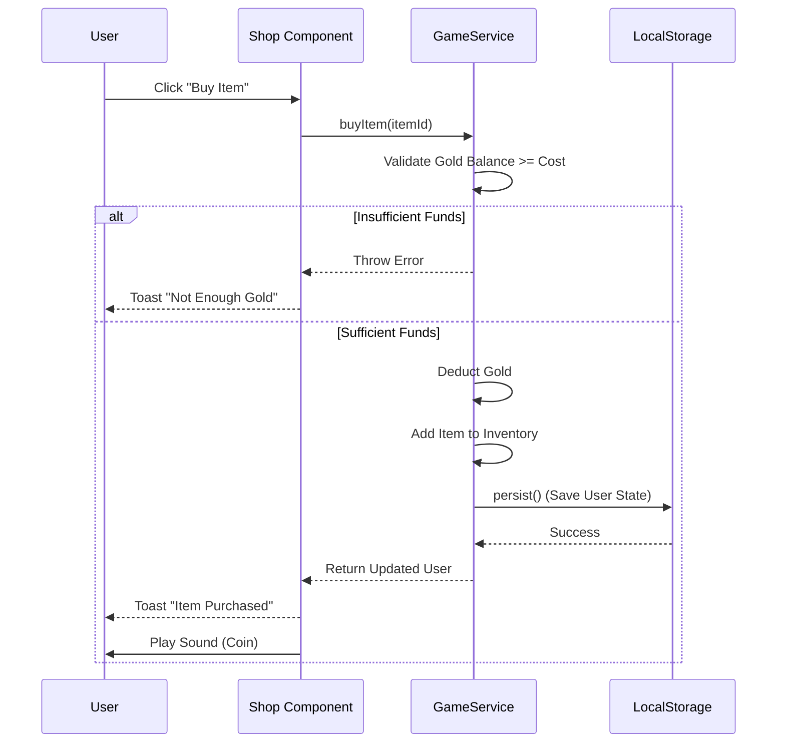
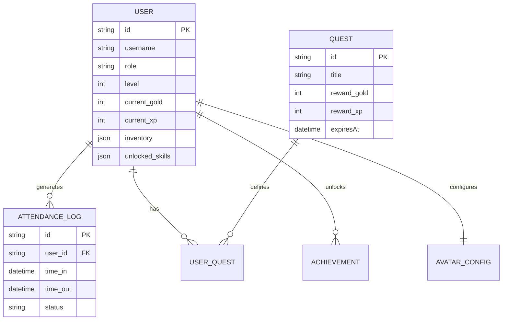

# Chapter 6: Software Model and Design

## 6.1 Software Development Model
**gOwOrk** utilizes an **Agile/Component-Based** development model.
*   **Justification:** React's component architecture inherently supports iterative development. Features (like the "Pet Widget" or "Minigame") were developed as isolated components and integrated into the main `App` layout, allowing for rapid prototyping and testing without breaking the core system.

## 6.2 Sequence Diagram (Purchase Item)

## 6.3 Entity Relationship Diagram (ERD)

## 6.4 Database Schema (JSON Structure)

Although utilizing NoSQL-style JSON storage, the strict typing enforces a schema:

**Table: Users**
| Field | Type | Description |
| :--- | :--- | :--- |
| `id` | String (UUID) | Unique Identifier |
| `username` | String | Login credential |
| `role` | Enum | 'employee' or 'manager' |
| `avatar_json` | JSON Object | Stores Hat, Eyes, Clothing IDs |
| `inventory` | Array<String> | List of owned Item IDs |
| `pet` | Object | Stores Pet Name, Hunger, Happiness |

**Table: AttendanceLogs**
| Field | Type | Description |
| :--- | :--- | :--- |
| `id` | String (Timestamp) | Unique Identifier |
| `user_id` | String | Foreign Key to User |
| `date` | String (ISO) | Date of shift |
| `time_in` | String (ISO) | Clock In Timestamp |
| `status` | Enum | 'ontime', 'late', 'early_bird', 'critical_hit' |

## 6.5 User Interface Design

### Guidelines
*   **Color Palette:** Retro Gold (`#ff9900`), Success Green (`#4ade80`), Danger Red (`#f87171`), Dark Background (`#1a1a1a`).
*   **Typography:** 'VT323' (Monospace Pixel Font) for all text.
*   **Feedback:** All interactive elements must provide visual (scale/color change) and auditory (chip sound) feedback.

### UI Mockup Descriptions
1.  **Dashboard (Home):** Features the 3D Avatar center stage. Top bar displays Level, XP bar, and Gold. Bottom bar provides navigation tabs. Overlays include the "Boss Event" widget and "Weather" indicator.
2.  **Manager Dashboard:** A tabbed interface. "Controls" allows setting global buffs. "Analytics" displays bar charts for productivity. "HR Dept" provides a table view of staff with action buttons (Edit, Ban, Smite).
3.  **Shop:** A grid of cards displaying items. Owned items show "Equip", unowned show price. Top section features the "Mystery Box" Gacha mechanic.
