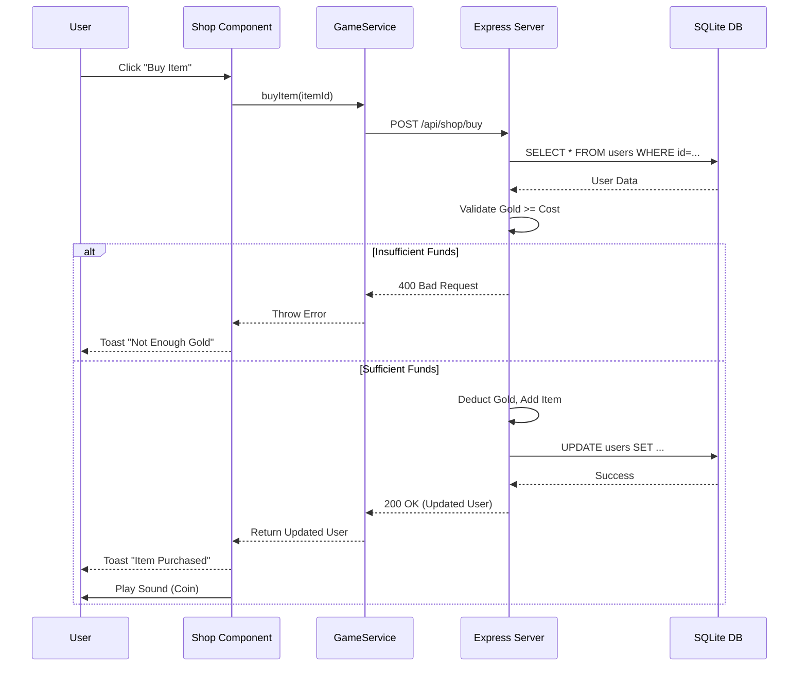
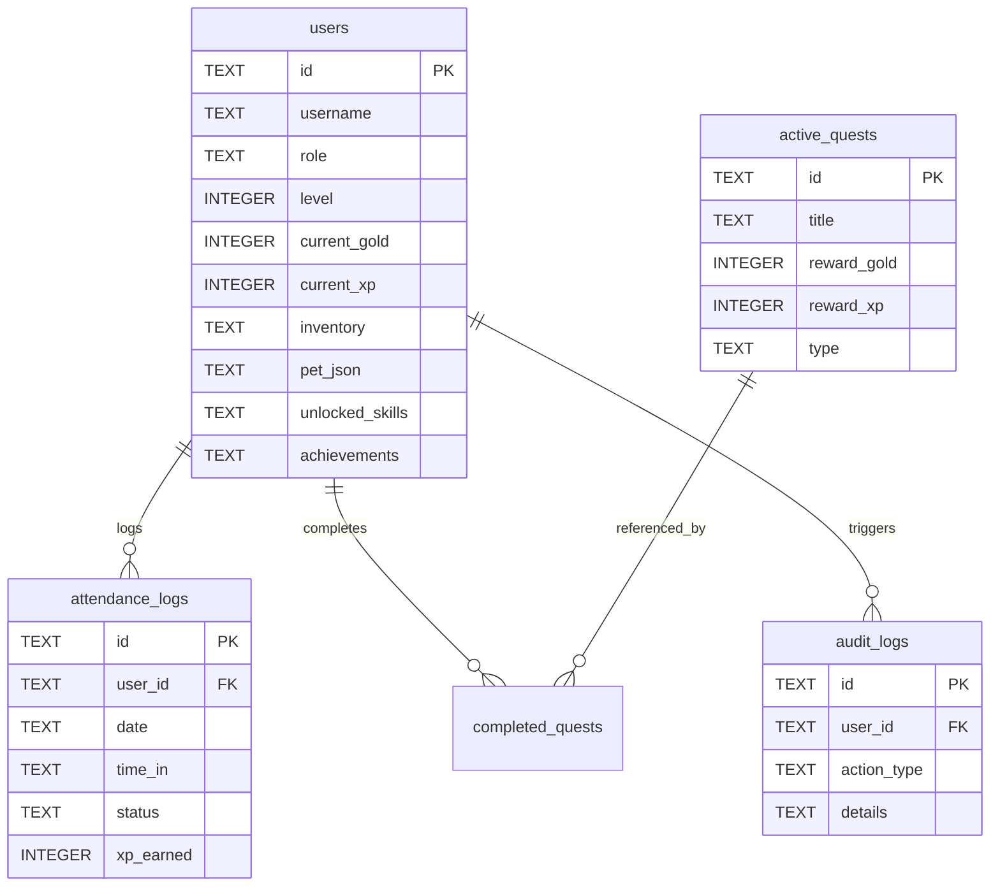

# Chapter 6: Software Model and Design

## 6.1 Software Development Model
**gOwOrk** utilizes an **Agile/Component-Based** development model.
*   **Justification:** React's component architecture inherently supports iterative development. Features were developed as isolated components and integrated into the main `App` layout, communicating with a unified Backend API.

## 6.2 Sequence Diagram (Purchase Item)

This diagram illustrates the process flow when a user attempts to purchase an item from the shop via the API.

## 6.3 Entity Relationship Diagram (ERD)

The ERD below represents the data structure stored in the SQLite database.

## 6.4 Database Schema (SQL Structure)

The system uses a relational SQLite database. Below are the actual table definitions used by the backend.

**Table: `users`**
| Field | Type | Description |
| :--- | :--- | :--- |
| `id` | TEXT (UUID) | Unique Identifier |
| `username` | TEXT | Login credential |
| `password_hash` | TEXT | SHA-256 hashed password |
| `name` | TEXT | Display Name |
| `role` | TEXT | 'employee', 'manager', 'moderator' |
| `level` | INTEGER | Current RPG Level |
| `current_xp` | INTEGER | Experience Points |
| `current_gold` | INTEGER | Virtual Currency |
| `current_hp` | INTEGER | Current Health Points |
| `total_hp` | INTEGER | Max Health Points |
| `streak` | INTEGER | Consecutive days worked |
| `skill_points` | INTEGER | Points available for Skill Tree |
| `kudos_received` | INTEGER | Social recognition count |
| `is_banned` | BOOLEAN | Account suspension status |
| `avatar_json` | TEXT (JSON) | Customization (Hat, Eyes, Clothing) |
| `inventory` | TEXT (JSON) | List of owned Item IDs |
| `achievements` | TEXT (JSON) | List of unlocked Achievement IDs |
| `unlocked_skills` | TEXT (JSON) | List of unlocked Skill IDs |
| `pet_json` | TEXT (JSON) | Pet stats (Name, Hunger, Happiness) |

**Table: `attendance_logs`**
| Field | Type | Description |
| :--- | :--- | :--- |
| `id` | TEXT | Unique Identifier |
| `user_id` | TEXT | Foreign Key to User |
| `date` | TEXT | Date of shift (YYYY-MM-DD) |
| `time_in` | TEXT | Clock In Timestamp ISO |
| `time_out` | TEXT | Clock Out Timestamp ISO |
| `status` | TEXT | 'ontime', 'late', 'early_bird', 'critical_hit' |
| `xp_earned` | INTEGER | XP awarded for this shift |

**Table: `active_quests`**
| Field | Type | Description |
| :--- | :--- | :--- |
| `id` | TEXT | Unique Identifier |
| `title` | TEXT | Quest Title |
| `description` | TEXT | Quest Description |
| `reward_gold` | INTEGER | Gold Reward |
| `reward_xp` | INTEGER | XP Reward |
| `type` | TEXT | 'Daily', 'Party', 'Urgent' |
| `expires_at` | INTEGER | Expiration Timestamp |

**Table: `audit_logs`**
| Field | Type | Description |
| :--- | :--- | :--- |
| `id` | TEXT | Unique Identifier |
| `user_id` | TEXT | User who performed action |
| `action_type` | TEXT | 'SHOP', 'ADMIN', 'SYSTEM', 'WORK', etc. |
| `details` | TEXT | Human readable description |
| `timestamp` | INTEGER | Time of action |

## 6.5 User Interface Design

### 6.5.1 Rules and Guidelines for User Interface Designing

The following principles ensure a functional and engaging UI for gOwOrk:

1.  **Input Validation:**
    *   **Client-Side:** React state prevents submission of empty forms.
    *   **Server-Side:** API endpoints validate all payloads to ensure data integrity.

2.  **Error Messages & Warnings:**
    *   **Toast System:** API errors are caught by `GameService` and displayed as red toast notifications.
    *   **Confirmation:** Critical actions (like "Reset Game Data") require confirmation.

3.  **Visual Language:**
    *   **Color Palette:** Retro Gold (`#ff9900`) for rewards, Success Green (`#4ade80`) for actions, Danger Red (`#f87171`) for penalties/errors.
    *   **Typography:** 'VT323' (Monospace Pixel Font) used universally.
