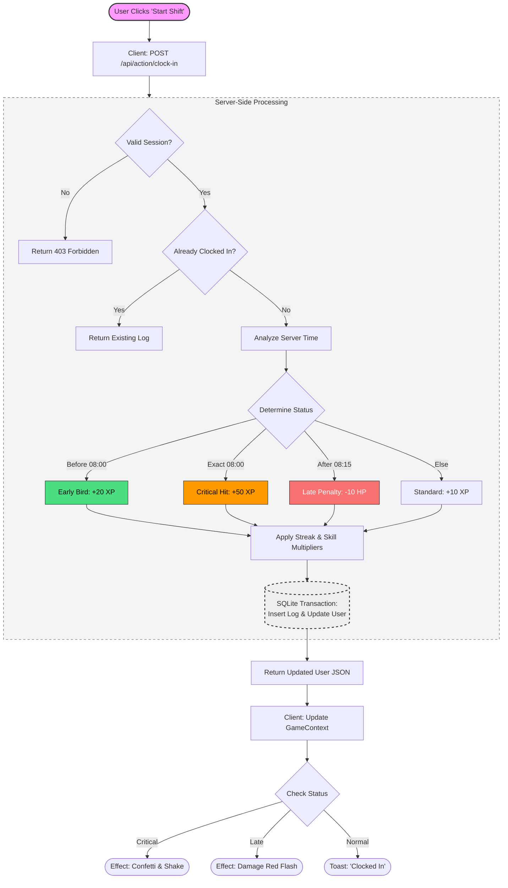

# Chapter 4

## 4. Architectural Design

### 4.1 High Level Components and Interfaces

The software architecture of the **gOwOrk** system is designed using a modern, component-based approach to ensure scalability and maintainability. This section identifies the high-level software modules, libraries, and frameworks that constitute the system's core structure.

#### 4.1.1 Components

| Component | Description | Usage in gOwOrk |
| :--- | :--- | :--- |
| **React (v18) + Vite** | Frontend Framework and Build Tool. | Renders the Single Page Application (SPA), manages UI state, and handles the 3D Voxel rendering via Three.js. |
| **Node.js + Express** | Backend Runtime and Web Framework. | Serves the static frontend assets and hosts the REST API endpoints. Handles all authentication and critical business logic. |
| **Better-SQLite3** | Synchronous SQLite driver for Node.js. | Interfaces directly with the file-based database (`gowork.db`) on the server to store relational data. |
| **Three.js** | 3D Graphics Library. | Renders the character avatar, lighting, and weather effects in the browser. |
| **Tailwind CSS** | Utility-first CSS framework. | Handles the responsive styling and "Retro" aesthetic of the user interface. |

#### 4.1.2 Interfaces

The system’s components interact and communicate using the following interfaces:

1.  **REST API (Type: Network Protocol):** The primary communication channel. The client sends JSON payloads to the server, and the server responds with updated user state or error messages.
2.  **React Context API (Type: Internal State Management):** Exposes the loaded User object and Game state to UI components, ensuring the view is synced with the latest API response.
3.  **SQL Interface (Type: Data Persistence):** The server executes prepared SQL statements to read/write data securely to the disk.

### 4.2 Physical Arrangement of Devices in a Typical Network

Since **gOwOrk** is designed as a web application, the topology follows a standard Client-Server model.

*   **Client Layer:** The user's device (Desktop/Mobile) runs the React Application in the browser. It handles rendering and user input.
*   **Server Layer:** A Node.js process (hosted on Render, VPS, or local machine) listens for HTTP requests. It hosts the SQLite database file on its local file system.
*   **Data Layer:** The `gowork.db` file residing on the Server Layer's disk.

### 4.3 User Flow Diagram

The diagram below details the complete logic flow for the "Clock-In" process, illustrating the validation steps, server-side calculations, and database transactions required to ensure data integrity and gamification accuracy.

### 4.4 Context Diagram

The boundary of the entire system is represented as a single process labeled "**gOwOrk Application**." This system interacts with two primary external entities: the **Employee** and the **Manager**.

*   The **Employee** interacts with the system to perform daily operations such as Clocking In, playing minigames, and buying items.
*   The **Manager** interacts with the system for administrative tasks, security monitoring, and data export.
*   The system communicates with the **SQLite Database**, which acts as the data repository.
